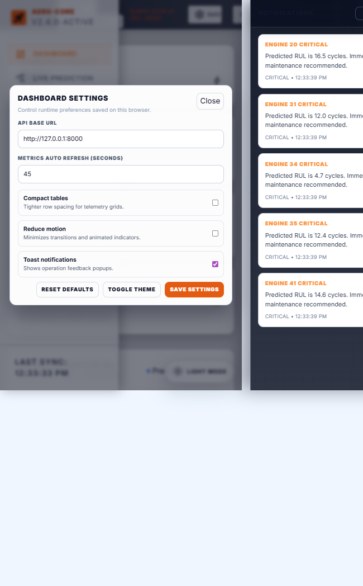

# AeroPredict: Aircraft Engine Remaining Useful Life Prediction

AeroPredict is an end-to-end predictive maintenance project for aircraft engines using the NASA C-MAPSS benchmark. It includes a deep learning training pipeline, evaluation tooling, a Flask API server, and a multi-page web dashboard for model diagnostics and live inference.

## Table of Contents

- Project Overview
- Core Capabilities
- Dashboard Gallery
- Data and Feature Pipeline
- Model Architecture and Training
- Cross-Dataset Generalization
- Evaluation
- API Endpoints
- Project Structure
- Setup and Run Guide
- Troubleshooting
- References

## Project Overview

This project predicts Remaining Useful Life (RUL) from multivariate time-series telemetry. It supports both in-distribution evaluation and cross-dataset domain generalization across FD001, FD002, FD003, and FD004 subsets.

It contains:

- A PyTorch LSTM regression model with uncertainty estimates via Monte Carlo dropout.
- A training script that supports single-source and multi-source training.
- An evaluation script that reports per-dataset metrics and uncertainty summaries.
- A Flask API server exposing model and telemetry endpoints.
- A dashboard suite for operational and model-level visibility.

## Core Capabilities

- Multi-dataset training across FD001, FD002, FD003, and FD004.
- Strict train-only scaling to reduce data leakage.
- Cross-dataset evaluation with feature-alignment and zero-padding for missing channels.
- Engine-level and fleet-level prediction views.
- API-backed dashboards using real responses (no mock prediction payloads).
- UI settings support (API base URL, refresh, motion, compact layout, notifications).

## Dashboard Gallery

### Main Dashboard

Fleet overview, KPI cards, scatter/error charts, and high-level model summary.


### Live Prediction Panel

Dataset-aware prediction workflow with engine selector, risk display, uncertainty, and sensor/rul history charts.


### Model Insights

Visual diagnostics for model behavior and learning progress.


### Model Details and Architecture

Model internals, architecture context, and technical interpretation.


### Data Explorer

Telemetry browsing and dataset exploration views.


### API Deployment Demo

Interactive API request/response presentation.


### Dashboard Settings

Runtime preferences panel for API base URL, refresh interval, compact tables, motion, and toast notifications.



## Data and Feature Pipeline

### Supported Datasets

- FD001
- FD002
- FD003
- FD004

### Input Schema

- Operational settings: `setting_1..setting_3`
- Sensor channels: `sensor_1..sensor_21`
- Time index fields: `unit_id`, `cycle`

### RUL Target Construction

- Training target is generated per engine using `max(cycle) - cycle`.
- Final test labels are merged with NASA-provided final RUL files.
- RUL is capped at `max_rul` (default: `125`).

### Sequence Construction

- Sequence length default: `50`
- Short sequences can be padded in selected inference/evaluation flows.
- Validation split is engine-wise (unit_id split) to avoid sequence leakage.

### Cross-Dataset Handling

- Feature columns are aligned to the model-trained feature order.
- If target dataset lacks channels present during training, missing channels are zero-padded.
- Inference uses:
	- Original trained scaler for datasets seen during training.
	- Fresh dataset-specific scaler for unseen datasets.

## Model Architecture and Training

### Model

- Type: LSTM regression model (`LSTMRULPredictor`)
- LSTM layers: 2
- Hidden size: 64
- Dropout: 0.2
- Output: single continuous RUL value

### Training Defaults

- Train datasets: `FD001 FD002 FD003 FD004`
- Test datasets: `FD001 FD002 FD003 FD004`
- Mode: `auto` (resolved to `multi-source` when multiple train datasets are provided)
- Epochs: 30
- Batch size: 128
- Learning rate: `1e-3`
- Weight decay: `1e-5`
- Validation fraction: 0.2
- Early stopping patience: 7

### Generated Artifacts

- `models/lstm_rul.pth` (checkpoint with config + metrics)
- `models/scaler.pkl` (saved scaler)
- `models/training_history.json` (epoch metrics)
- `models/learning_curves.png`
- `models/actual_vs_predicted_FD00X.png`
- `models/error_histogram_FD00X.png`

## Cross-Dataset Generalization

Training supports three experiment patterns:

- In-distribution: single train dataset, same test dataset.
- Cross-dataset transfer: single source, different target(s).
- Multi-source generalization: multiple sources, evaluate across multiple domains.

Example commands:

```bash
# In-distribution baseline
python src/train.py --train-datasets FD001 --test-datasets FD001

# Cross-dataset transfer
python src/train.py --train-datasets FD001 --test-datasets FD004

# Multi-source generalization
python src/train.py --train-datasets FD001 FD002 FD003 FD004 --test-datasets FD001 FD002 FD003 FD004 --mode multi-source --epochs 20 --patience 5
```

## Evaluation

The evaluation script supports single-dataset or full multi-dataset stats in one run.

```bash
# Evaluate all configured datasets in checkpoint
python src/evaluate.py --dataset ALL --mc-samples 20

# Evaluate one dataset
python src/evaluate.py --dataset FD003 --mc-samples 50
```

Evaluation output includes:

- RMSE
- MAE
- NASA score
- Uncertainty summary (avg/min/max std)
- Sample count
- Missing feature padding summary
- Checkpoint metrics snapshot

### Final multi-source training results

Captured from the final multi-source training run (train: `FD001 FD002 FD003 FD004`, mode: `multi-source`, epochs: 20):

| Dataset | RMSE | MAE | NASA score |
| --- | ---: | ---: | ---: |
| FD001 | 13.86 | 9.74 | 312.14 |
| FD002 | 15.08 | 11.26 | 1329.30 |
| FD003 | 15.73 | 10.84 | 1206.83 |
| FD004 | 16.22 | 11.78 | 1806.10 |

Saved artifacts from this run:

- `models/lstm_rul.pth` (final checkpoint)
- `models/scaler.pkl` (saved StandardScaler)

Command used to produce these results:

```bash
python src/train.py --train-datasets FD001 FD002 FD003 FD004 \
	--test-datasets FD001 FD002 FD003 FD004 \
	--mode multi-source --epochs 20 --patience 5
```

## API Endpoints

Core endpoints used by dashboards:

- `GET /api/summary`
- `GET /api/history`
- `GET /api/sample-prediction?dataset=FD00X&engineId=<id>`
- `GET /api/all-predictions?dataset=FD00X`
- `GET /api/engine-ids?dataset=FD00X`
- `GET /api/engine-history?dataset=FD00X&engineId=<id>`
- `GET /api/explorer?dataset=FD00X`
- `GET /api/notifications?dataset=FD00X`
- `POST /api/predict` (supports dataset-aware prediction payload)

Static/dashboard routes:

- `/Main_Dashboard.html`
- `/Live_Prediction_Panel.html`
- `/Model_Insights.html`
- `/Model_Details_Architecture.html`
- `/Data_Explorer.html`
- `/API_Deployment_Demo.html`

## Project Structure

```text
AEROPREDICT/
	aerospace-dashboard/
	data/
	docs/dashboard-shots/
	models/
	notebooks/
	src/
		api_server.py
		data_loader.py
		download_data.py
		evaluate.py
		model.py
		train.py
		train_advanced.py
	requirements.txt
	run_pipeline.cmd
	run_pipeline.sh
	test_environment.cmd
	test_environment.sh
```

## Setup and Run Guide

### 1) Install dependencies

```bash
pip install -r requirements.txt
```

### 2) (Optional) refresh dataset files

```bash
python src/download_data.py
```

### 3) Train model

```bash
python src/train.py --mode multi-source
```

### 4) Evaluate model

```bash
python src/evaluate.py --dataset ALL --mc-samples 20
```

### 5) Start API + dashboard

```bash
python src/api_server.py
```

Open in browser:

- http://127.0.0.1:8000/Main_Dashboard.html
- http://127.0.0.1:8000/Live_Prediction_Panel.html
- http://127.0.0.1:8000/Model_Insights.html
- http://127.0.0.1:8000/Model_Details_Architecture.html
- http://127.0.0.1:8000/Data_Explorer.html
- http://127.0.0.1:8000/API_Deployment_Demo.html

## Troubleshooting

### Dataset files contain HTML or malformed content

Cause: invalid download source previously saved a webpage instead of numeric data.

Fix:

```bash
python src/download_data.py
```

### Missing dataset files

Fix:

```bash
python src/download_data.py
```

### Torch or dependency import errors

Fix:

```bash
python -m pip install --upgrade -r requirements.txt
```

### Evaluation/training mismatch errors

If scaler or checkpoint shape mismatches appear, retrain and regenerate artifacts:

```bash
python src/train.py --train-datasets FD001 FD002 FD003 FD004 --test-datasets FD001 FD002 FD003 FD004 --mode multi-source
```

### Training is slow

Check acceleration availability:

```bash
python -c "import torch; print('CUDA:', torch.cuda.is_available()); print('MPS:', torch.backends.mps.is_available())"
```

Quick lighter run:

```bash
python src/train.py --epochs 10 --batch-size 64
```

### Out-of-memory issues

```bash
python src/train.py --batch-size 32 --seq-length 30
```

## References

- NASA C-MAPSS dataset: https://data.nasa.gov/dataset/cmapss-jet-engine-simulated-data
- Saxena, Goebel, Simon, Eklund: Damage Propagation Modeling for Aircraft Engine Run-to-Failure Simulation
