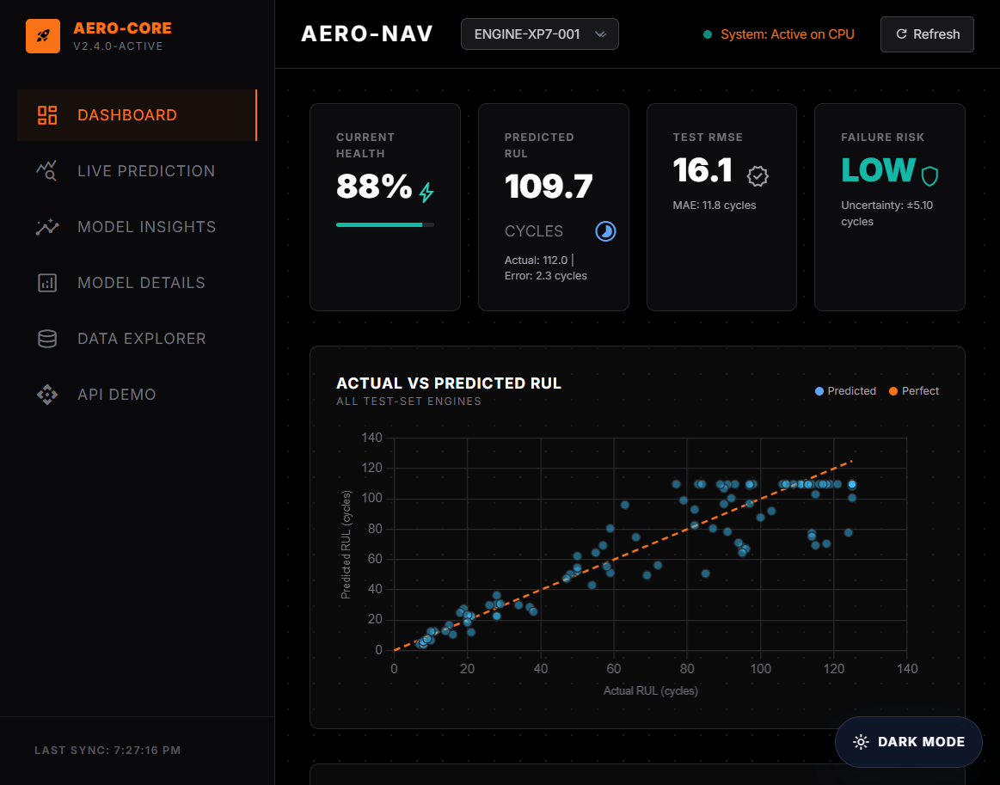
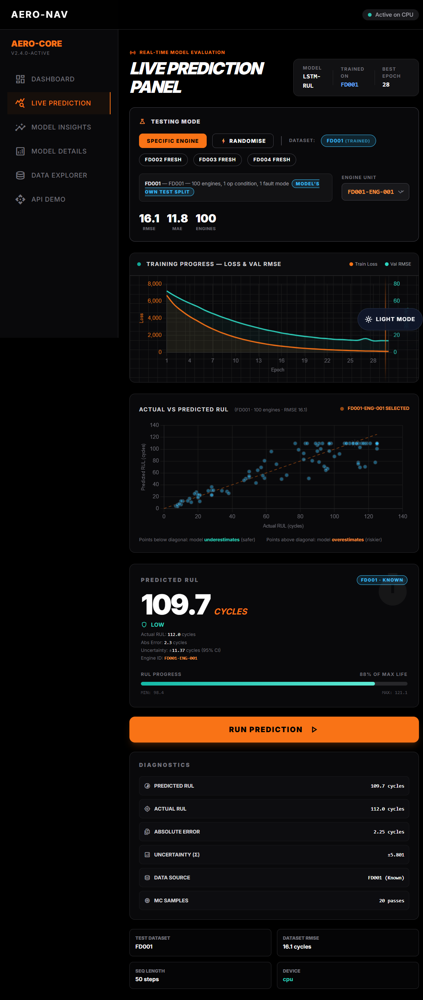
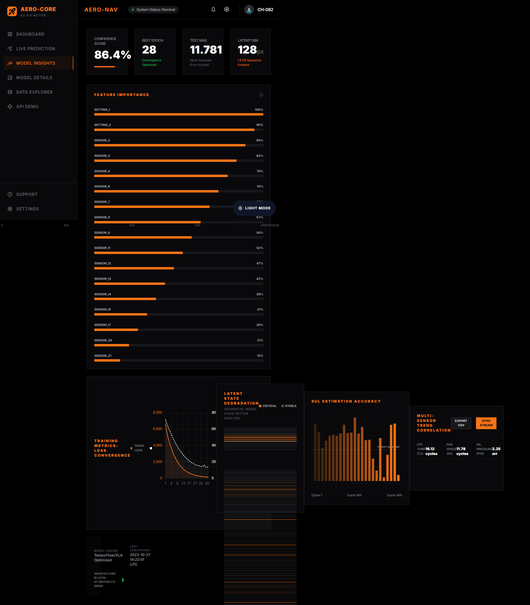
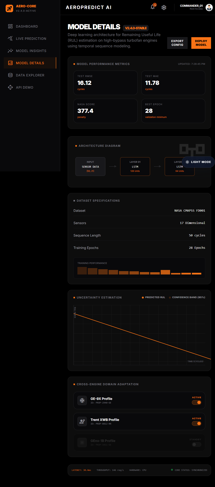
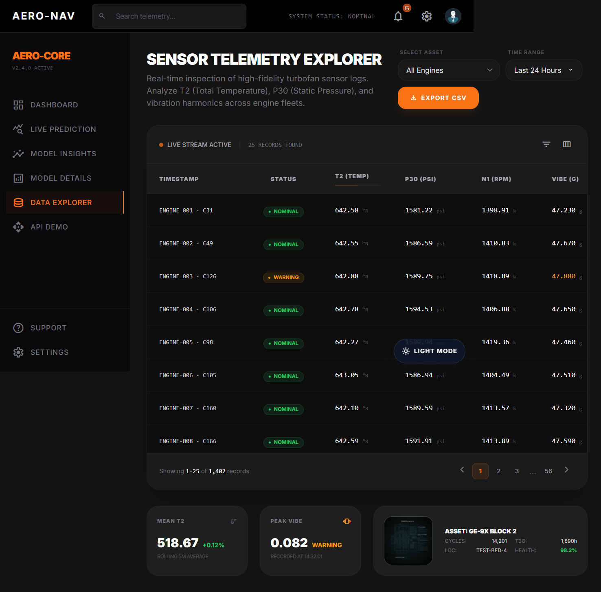
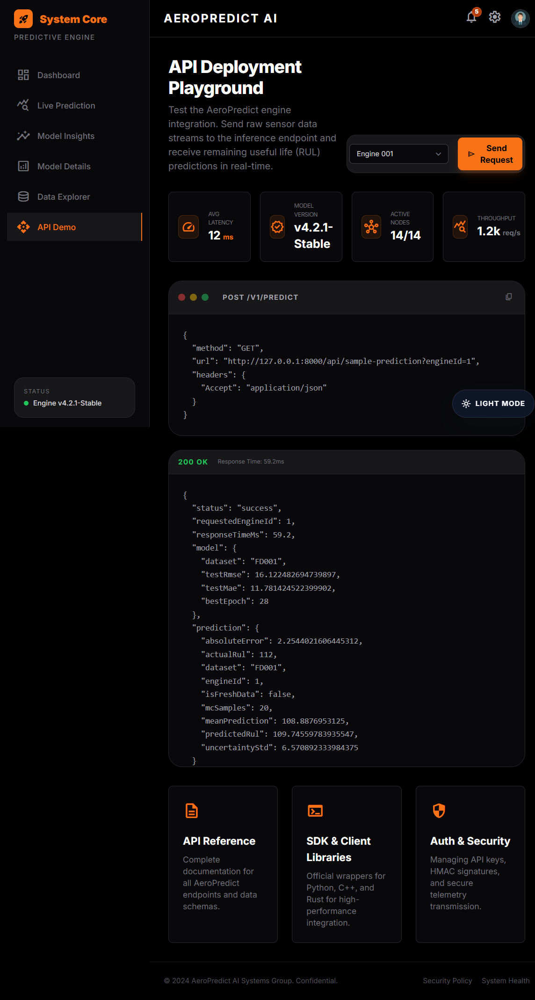

# AeroPredict

AeroPredict is a predictive maintenance dashboard for aircraft engines built around the NASA C-MAPSS Remaining Useful Life (RUL) benchmark. It combines a PyTorch LSTM model, a Flask API, and a set of interactive dashboard pages to inspect training quality, explore telemetry, and test live predictions.

## Quick Stats

- 6 dashboard pages
- 4 supported C-MAPSS datasets: FD001, FD002, FD003, FD004
- 21 sensor channels per engine cycle, plus operational settings
- FD001 evaluation: RMSE 16.1 cycles, MAE 11.8 cycles, best epoch 28
- Data Explorer sample: 1,402 telemetry records
- Model architecture: 2-layer LSTM with Monte Carlo dropout for uncertainty estimates

## What This Project Does

- Trains a Remaining Useful Life regressor on NASA C-MAPSS engine sequences
- Evaluates the saved checkpoint on FD001 and related cross-dataset splits
- Serves a local Flask API for summary, prediction, history, and explorer data
- Powers a six-page dashboard with live charts, model metrics, telemetry views, and an API demo
- Persists UI preferences such as theme, API base URL, notifications, and search behavior

## Dashboard Gallery

### Main Dashboard
Overview cards, current prediction summary, and the main cross-model KPI view.



### Live Prediction Panel
Dataset-aware prediction controls, training history playback, and actual-vs-predicted scatter analysis.



### Model Insights
Training convergence, feature importance, latent state trends, and sensor correlation summaries.



### Model Details
Architecture breakdown, model performance metrics, dataset specification, and uncertainty framing.



### Data Explorer
Telemetry browsing with filtering, engine selection, record counts, and export support.



### API Demo
A live request/response playground for the prediction endpoint with request and response panels.



## Model Summary

- Architecture: 2-layer LSTM
- Hidden size: 64
- Dropout: 0.2
- Sequence length: 50 cycles
- RUL cap: 125 cycles
- Optimizer: Adam
- Loss: MSE
- Uncertainty: Monte Carlo dropout during inference

## Pipeline

1. Load NASA C-MAPSS train, test, and RUL files.
2. Build capped RUL targets for each engine sequence.
3. Scale features using training-only statistics.
4. Train the LSTM with validation and early stopping.
5. Save the best checkpoint and training history.
6. Serve the model through the Flask API and dashboard pages.

## Setup

### 1. Install dependencies

```bash
pip install -r requirements.txt
```

### 2. Start the API and dashboard

On Windows:

```powershell
python src/api_server.py
```

On macOS or Linux:

```bash
python3 src/api_server.py
```

Then open:

- http://127.0.0.1:8000/Main_Dashboard.html
- http://127.0.0.1:8000/Live_Prediction_Panel.html
- http://127.0.0.1:8000/Model_Insights.html
- http://127.0.0.1:8000/Model_Details_Architecture.html
- http://127.0.0.1:8000/Data_Explorer.html
- http://127.0.0.1:8000/API_Deployment_Demo.html

### 3. Run the training pipeline

```bash
python src/train.py
```

## API Endpoints

- `/api/summary` returns dataset, configuration, metrics, and artifact metadata
- `/api/history` returns the training curve history
- `/api/sample-prediction` returns one engine prediction with uncertainty
- `/api/all-predictions` returns actual vs predicted RUL scatter data
- `/api/engine-ids` returns valid engine IDs for the selected dataset
- `/api/explorer` returns the telemetry table data
- `/api/notifications` returns dashboard notification items

## Saved Artifacts

- `models/lstm_rul.pth`: trained checkpoint
- `models/scaler.pkl`: fitted scaler used for inference
- `models/training_history.json`: epoch-level training metrics
- `models/training_loss.png`: training curve figure
- `models/predictions_analysis.png`: prediction quality figure

## Data Notes

- FD001 is the main in-distribution evaluation dataset.
- FD002, FD003, and FD004 are exposed as fresh cross-dataset test views in the dashboard.
- Some constant or near-constant channels are dropped during preprocessing.
- The explorer page and dashboard cards are driven by live API responses, not hardcoded mock data.

## Troubleshooting

- If the dashboard says the server is offline, confirm `src/api_server.py` is running.
- If a page appears stale, refresh the browser after restarting the API.
- If training artifacts are missing, rerun the training step so the model files and history JSON are regenerated.

## References

- NASA C-MAPSS data: https://data.nasa.gov/dataset/cmapss-jet-engine-simulated-data
- Saxena, Goebel, Simon, and Eklund, "Damage Propagation Modeling for Aircraft Engine Run-to-Failure Simulation"
